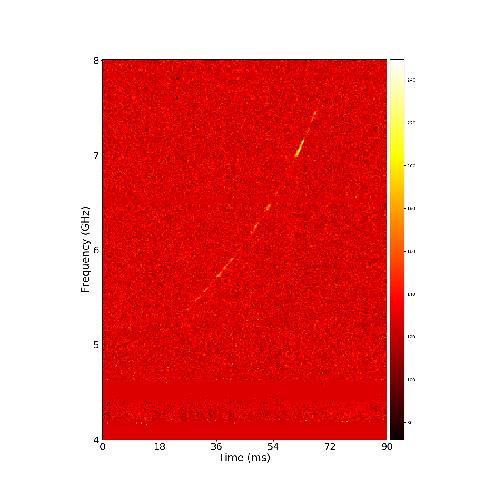
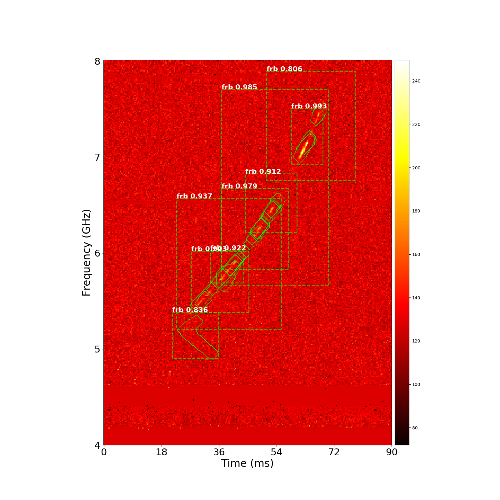

# Mask R-CNN to Detect Fast Radio Bursts (FRBs)

This is an extension of [matterport's Mask R-CNN](https://github.com/matterport/Mask_RCNN) code to help detect FRBs.

This repository includes:
* [train_frb.py](train_frb.py) &mdash; a script used for training the model
* [classify_frb.py](classify_frb.py) &mdash; a script used for detecting FRBs in images and saving the results
* [frb.py](frb.py) &mdash; contains the FRBConfig and FRBDataset classes used by the model to handle the dataset

This repository does not include:
* model weights

